# Задание 1. Скриншот с багами

 Приоритеты: P0 — критический, P1 — высокий, P2 — средний, P3 — низкий.

-----

## 1. Орфографическая ошибка

- **Приоритет:** P3
- **Тип:** Орфография
- **Фактический результат:** В хлебной крошке отображается текст «Коръера».
- **Ожидаемый результат:** Должно быть написано «Карьера».
- **Скриншот с багом:**  

  

--------

## 2. Нелогичный путь в хлебных крошках 

- **Приоритет:** P3
- **Тип:** UI / Логика
- **Фактический результат:** Отображается путь «Главная > Животные > Персидская > Кошки».
- **Ожидаемый результат:** Логичный путь для поиска кошек персидской породы: «Главная > Кошки > Персидская».
- **Скриншот с багом:**  

  
- **Как должно быть:**  «Главная > Животные > Кошки >Персидская»

  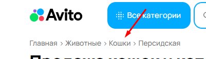

--------

## 3. Техническое сообщение об ошибке

- **Приоритет:** P1
- **Тип:** UI / Техническая ошибка 
- **Фактический результат:** Над полем «Уведомлять о новых» отображается очень маленьким шрифтом текст «Ошибка, обновите страницу».
- **Ожидаемый результат:** Сообщение должно быть видно пользователю.
- **Скриншот с багом:**  

   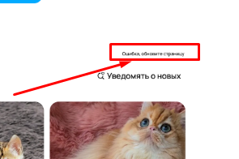
---
## 4. Орфографическая ошибка в тексте

- **Приоритет:** P3
- **Тип:** Орфография
- **Фактический результат:** Написано «Уведомять».
- **Ожидаемый результат:** Должно быть написано «Уведомлять».
- **Скриншот с багом:**  

  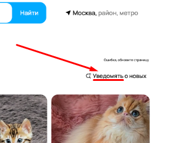
---
## 5. Несовпадение города в фильтре и выдаче

- **Приоритет:** P1
- **Тип:** Логика / Фильтрация
- **Фактический результат:** Выбран город «Москва», но возле сортировки есть кнопка Switch для выбора «Сначала из Можайска», но Можайск это другой город.
- **Ожидаемый результат:** Возле кнопки Switch должно быть написано «Сначала из Москвы»
- **Скриншот с багом:**  
  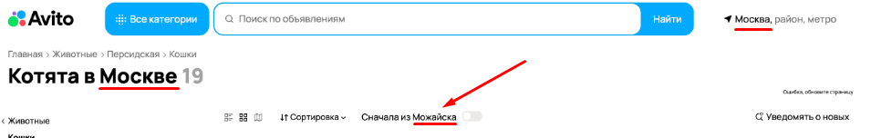
---
## 6. Отсутствие поля с выбором породы

- **Приоритет:** P1
- **Тип:** Функциональность / UI
- **Фактический результат:** В форме подачи объявления отсутствует поле с чекбоксом для выбора породы.
- **Ожидаемый результат:** Должно быть поле для выбора породы, напротив которого можно поставить галочку.
- **Скриншот с багом:**  

  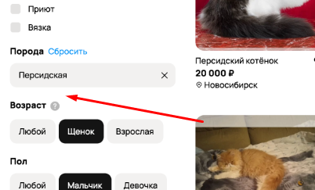
- **Как должно быть:**  

  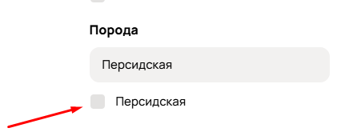
---
## 7. Некорректный возраст

- **Приоритет:** P1
- **Тип:** Логика / UI
- **Фактический результат:** В поле «Возраст» указано «Щенок», хотя ищутся кошки.
- **Ожидаемый результат:** Должно быть указано «Котёнок».
- **Скриншот с багом:**  

  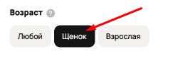
---
## 8. Отсутствие поля «Окрас»

- **Приоритет:** P1
- **Тип:** Функциональность / UI
- **Фактический результат:** В форме подачи объявления отсутствует поле «Окрас».
- **Ожидаемый результат:** Должно быть поле для указания окраса животного.
- **Скриншот с багом:**  

  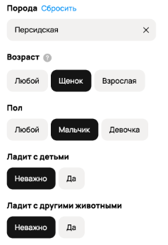
- **Как должно быть:**  

  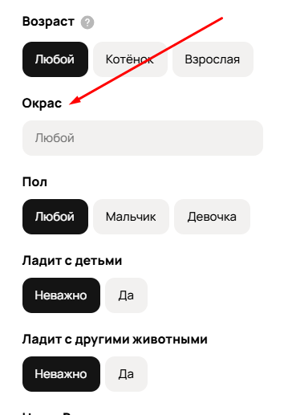
---
## 9. Несовпадение количества найденных объявлений

- **Приоритет:** P1
- **Тип:** Логика / Фильтрация
- **Фактический результат:** Система показывает «Найдено 19 объявлений», но по факту в выдаче только 8.
- **Ожидаемый результат:** Количество объявлений в выдаче должно соответствовать указанному в результатах поиска.
- **Скриншот с багом:**  

  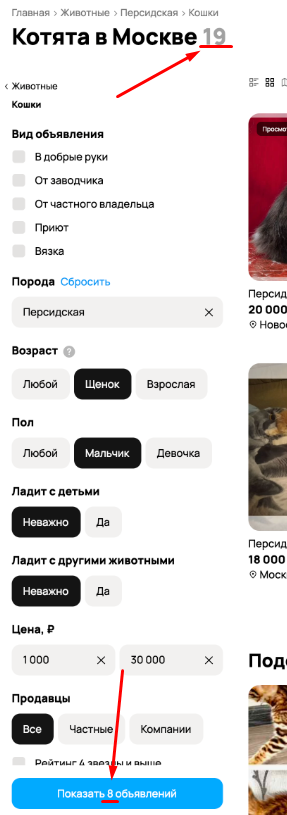
---
## 10. Объявления вне указанной цены

- **Приоритет:** P0
- **Тип:** Логика / Фильтрация
- **Фактический результат:** В результатах поиска появляются объявления, выходящие за рамки указанной цены.
- **Ожидаемый результат:** В выдаче должны отображаться только объявления, соответствующие указанному ценовому диапазону.
- **Скриншот с багом:**  
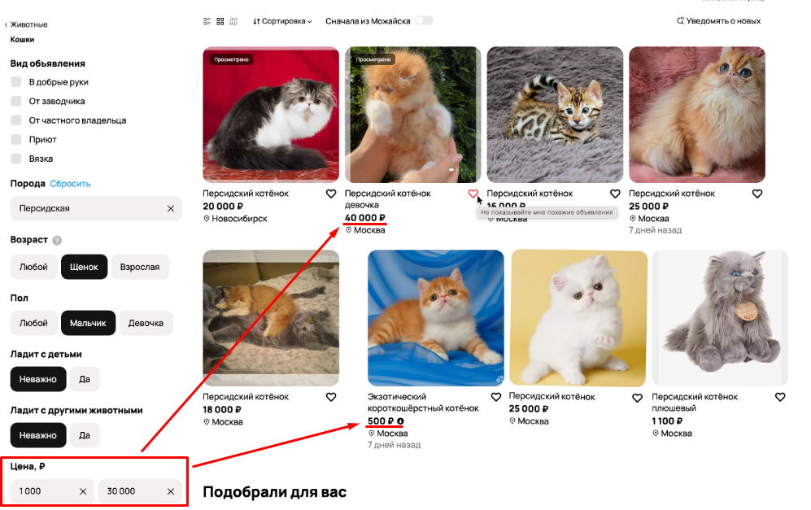
---
## 11. Объявления, не относящиеся к животным

- **Приоритет:** P0
- **Тип:** Логика / Фильтрация
- **Фактический результат:** В выдаче присутствует игрушка, которая не относится к животным.
- **Ожидаемый результат:** В выдаче должны отображаться только объявления, соответствующие выбранной категории «Животные».
- **Скриншот с багом:**  

  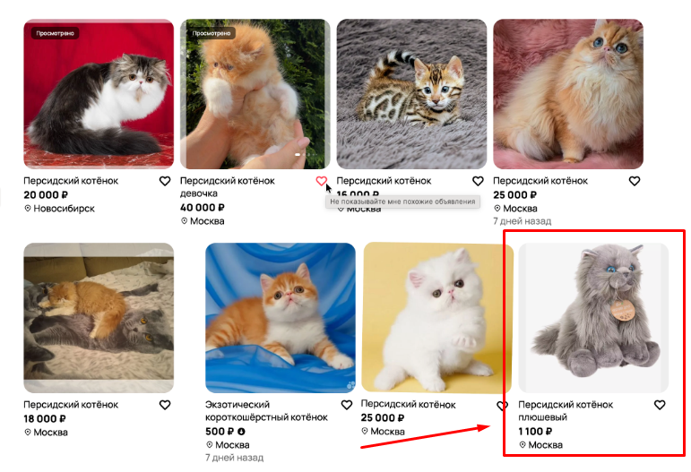
---
## 12. Объявления за пределами выбранного города

- **Приоритет:** P0
- **Тип:** Логика / Фильтрация
- **Фактический результат:** В выдаче есть объявления из других городов, хотя фильтр настроен на Москву.
- **Ожидаемый результат:** В выдаче должны отображаться только объявления из выбранного города.
- **Скриншот с багом:**  

  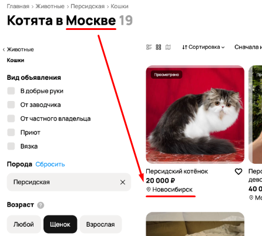
---
## 13. Некорректная подсказка при наведении на лайк

- **Приоритет:** P2
- **Тип:** UI / Локализация
- **Фактический результат:** При наведении на иконку лайка всплывает текст «не показывайте мне похожие обновления».
- **Ожидаемый результат:** Должно быть написано «Добавить в избранное и в сравнение».
- **Скриншот с багом:**  

  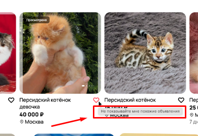
---
## 14. Съехавшее изображение в карточке

- **Приоритет:** P1
- **Тип:** UI / Вёрстка
- **Фактический результат:** В итоговой выборке некорректно отображается изображение (съехало).
- **Ожидаемый результат:** Изображение должно отображаться корректно, без смещений.
- **Скриншот с багом:**  

  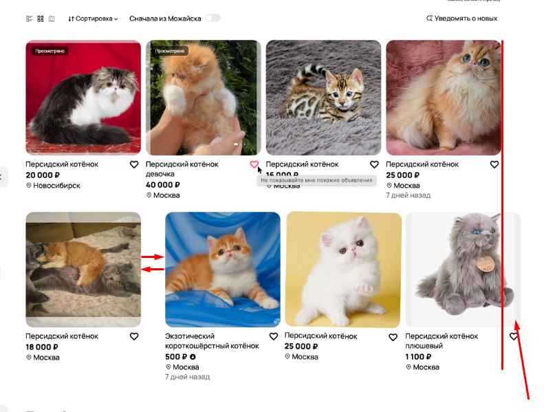
---
## 15. Обрезка последнего фото в блоке «Подобрали для вас»

- **Приоритет:** P2
- **Тип:** UI / Вёрстка
- **Фактический результат:** Последнее фото обрезается и выходит за границы страницы.
- **Ожидаемый результат:** Должна быть стрелка для пролистывания, последнее объявление должно незначительно выглядывать.
- **Скриншот с багом:**  

  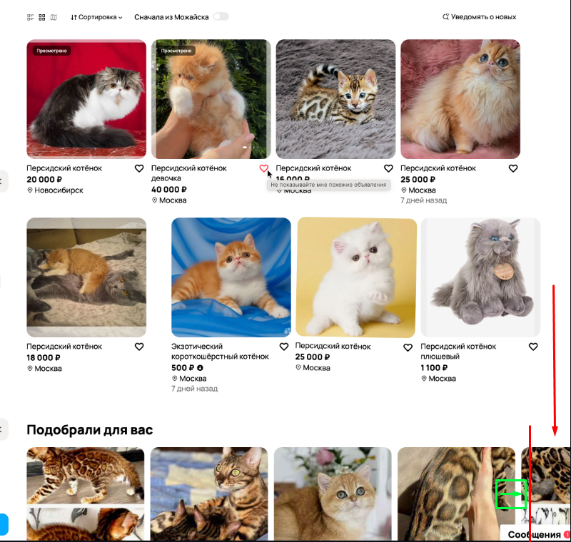
- **Как должно быть:**  

  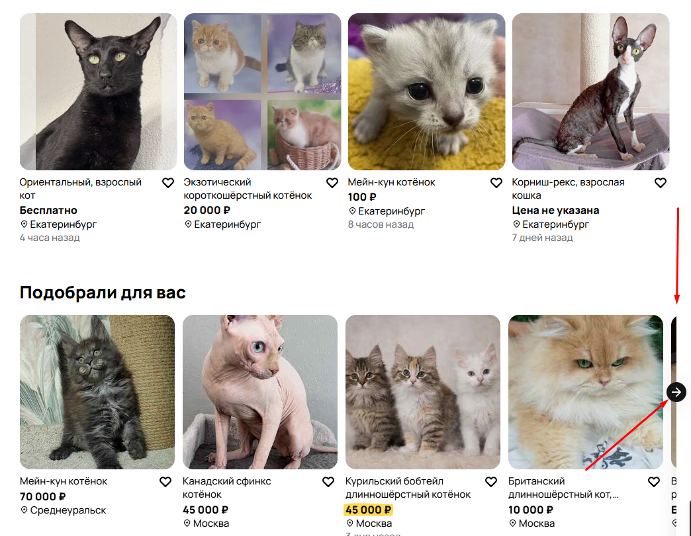
---
## 16. Объявление без указания породы в названии (возможный баг)

- **Приоритет:** P1
- **Тип:** Логика / Поиск
- **Фактический результат:** В выдаче есть объявление «Экзотический короткошерстный котёнок», в названии нет упоминания персидской породы. (Возможно, при создании объявления в параметрах указана соответствующая порода, в таком случае всё отображено корректно).
- **Ожидаемый результат:** В выдаче должны отображаться объявления, соответствующие персидской породе.
- **Скриншот с багом:**  

  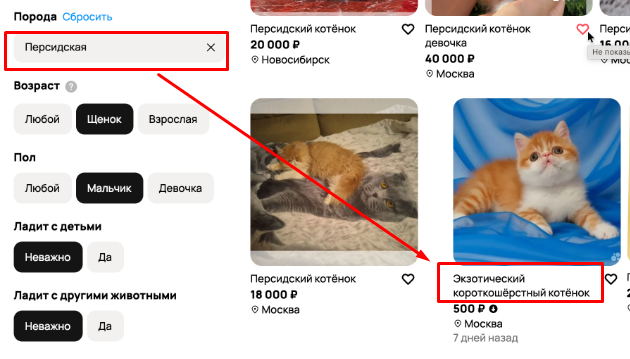
---
## 17. Объявление с неподходящим полом

- **Приоритет:** P0
- **Тип:** Логика / Фильтрация
- **Фактический результат:** В параметрах фильтра указан пол «Мальчик», но в выдаче есть объявление с девочкой.
- **Ожидаемый результат:** В выдаче должны отображаться только объявления, соответствующие выбранному полу.
- **Скриншот с багом:**  

  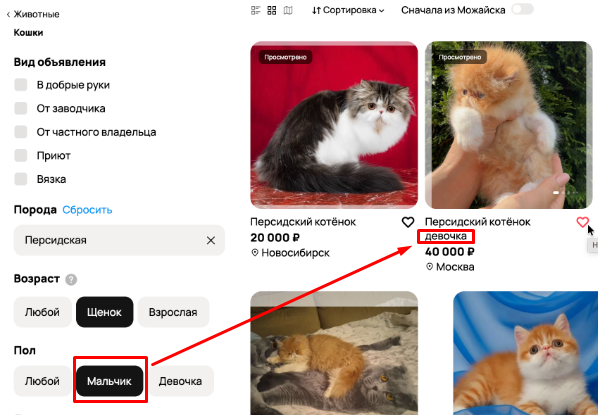
